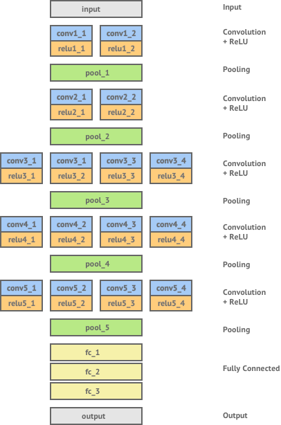
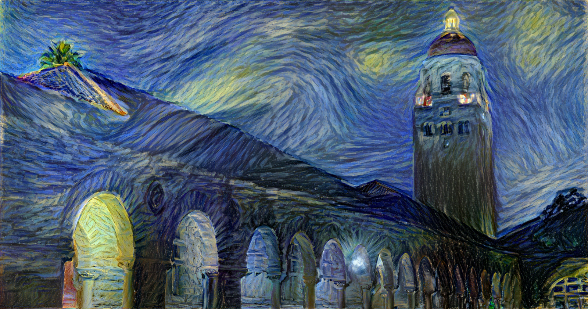
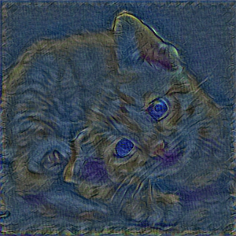

# Style-Transfer-Using-Tensorflow
## Introduction:

We all have used apps like Prisma and Lucid, but have you wondered how these things works? Like we upload a photo from our camera roll and select a design to mix both the images and we get a new image which has the content of our input image and style of the design image. In the world of deep learning this is called style transfer.

Style transfer is the technique of recomposing images in the style of other images. It all started when Gatys et al. published an awesome paper on how it was actually possible to transfer artistic style from one painting to another picture using convolutional neural networks

### Example:
 

 

# VGG Network:

 
All winning architectures of ImageNet Large Scale Visual Recognition Challenge in recent years have been some form of convolutional neural network — with the most recent winners even being able to surpass human level performance!

In 2014, the winner of the ImageNet challenge was a network created by Visual Geometry Group (VGG) at Oxford University, achieving a classification error rate of only 7.0%. Gatys et. al use this network — which has been trained to be extremely effective at object recognition — as a basis for trying to extract content and style representations from images.

## Result:

 
<b>+<b> 

  
### Output:

