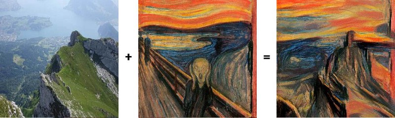

# Style-Transfer-Using-Tensorflow
## Introduction:

We all have used apps like Prisma and Lucid, but have you wondered how these things works? Like we upload a photo from our camera roll and select a design to mix both the images and we get a new image which has the content of our input image and style of the design image. In the world of deep learning this is called style transfer.

Style transfer is the technique of recomposing images in the style of other images. It all started when Gatys et al. published an awesome paper on how it was actually possible to transfer artistic style from one painting to another picture using convolutional neural networks

### Example:
 

